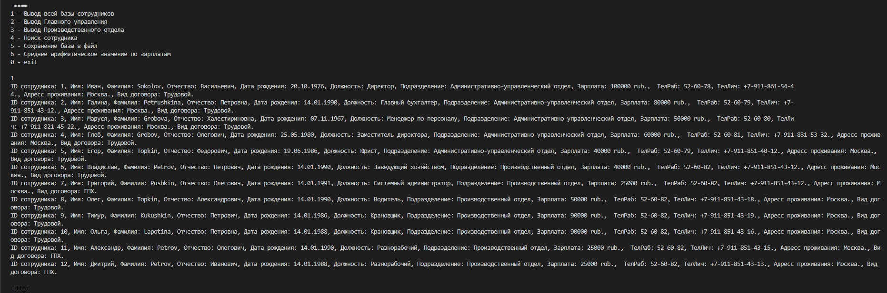
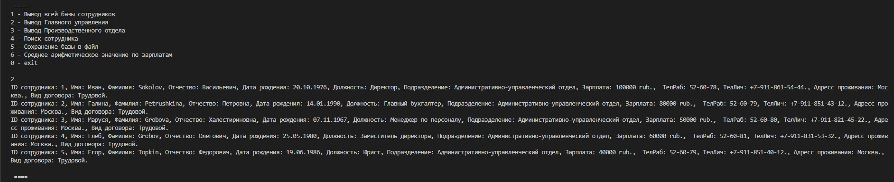
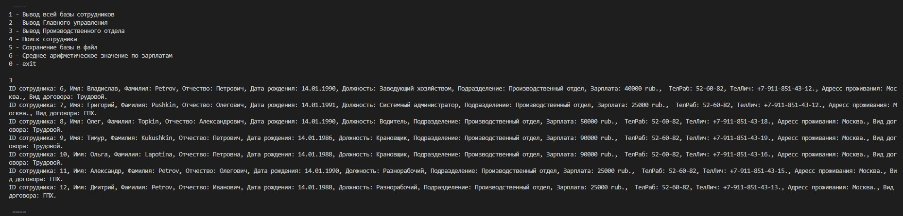
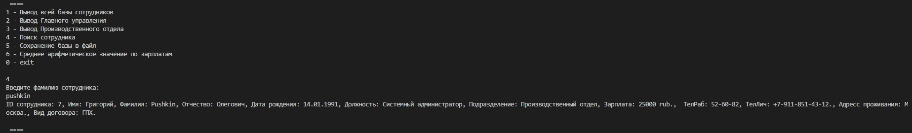

# Информационная система сотрудников компании.
## I. Архитектура информационной системы:
1. Модуль интерфейса меню взаимодействия с пользователем (Client)
2. Модуль обработки информации (Core/Operation)
3. База данных сотрудников компании (Core/Data)

## II. Порядок работы:
1. Программа запускается из модуля Program.java
2. Команды вводятся путем ввода с консоли цифры из выведенного на экран меню:
    - "1 - Вывод всей базы сотрудников"
    - "2 - Вывод Главного управления"
    - "3 - Вывод Производственного отдела"
    - "4 - Поиск сотрудника"
    - "5 - Сохранение базы в файл"
    - "6 - Среднее арифметическое значение по зарплатам"
    - "0 - exit"
3. Функции информационной системы:
   1. Вывод всей базы сотрудников
   
   2. Вывод Главного управления
   
   3. Вывод Производственного отдела
   
   4. Поиск сотрудника
   
   5. Сохранение базы в файл: происходит автоматическое создание txt файла (в нашем случае - baseWorkers.txt), в который записывается вся база сотрудников компании
   6. Среднее арифметическое значение по зарплатам
   
4. Программа закрывается путем ввода с консоли цифры 0, соответсвующей записи exit в меню

